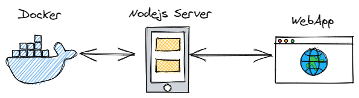

# Mini Project On Docker
Mini Project for my cousins to help them learn docker ;)

# Topic
Making deployments easy and scalable with docker on cloud

# Summary 
Now a days deployments plays a crutual role. Companies need faster deployments so that the new software update reaches customer as soon as possible. To do this we use docker a containerization technology. 
Docker helps up build, ship and deploy your software.

We will build a software which would take webcontent from Github/Zip and deploy it on fly. Within fraction of seconds your website is live. We can scale the website with the help of docker containers. Docker is a trending technology in the new fast paced market.

# Details

- The main motive of this project is to understand the power of the lastest cloud technology named "[Docker](https://www.docker.com)".
- This project is used to run web pages from Github/Zip with just a click of a button.
- A simple web page is used to add a Git Repository URL which has the webpage or a Zip file containing the web content. This web page also contains a button go.
- Once the go is pressed the web content is send to NodeJS Server which inturn interacts with docker to run the webpage which was in GithubUrl/Zip.
- Once the site is live within fraction of seconds we will get the URL of the page which we can use.
- We can run many websites like this on different ports within franction of seconds.

### More on Docker part
- Docker works similar to a Virtual Machine.
- VM are heaviy. It is complete OS running. 
- Docker Containers are small, fast, and portable.
- So basically in this project we will run mutiple light weight docker containers which has "Apache Httpd" server installed with the web content.
- Apache Httpd server is a web server which serves Html/CSS/JavaScript.
